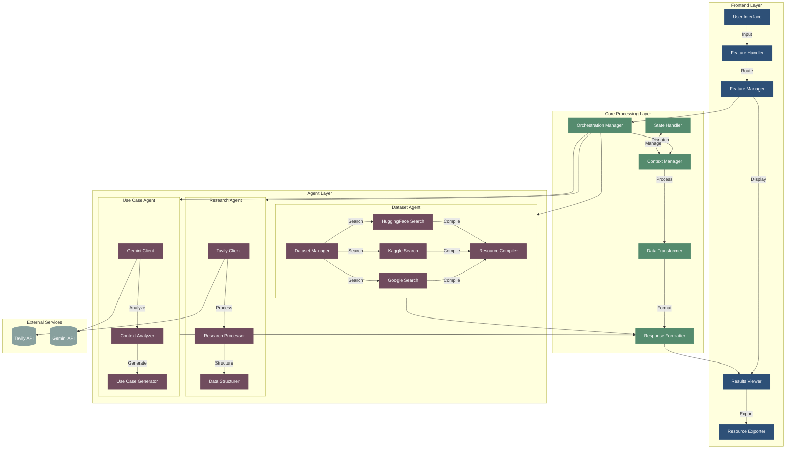

```mermaid
flowchart TD
    subgraph Frontend["Frontend Layer"]
        UI[User Interface] --> |Input| FH[Feature Handler]
        FH --> |Route| FM[Feature Manager]
        FM --> |Display| RV[Results Viewer]
        RV --> |Export| EX[Resource Exporter]
    end

    subgraph Core["Core Processing Layer"]
        OM[Orchestration Manager] --> |Dispatch| CM[Context Manager]
        CM --> |Process| DT[Data Transformer]
        DT --> |Format| RF[Response Formatter]
        SH[State Handler] <--> |Manage| CM
    end

    subgraph Agents["Agent Layer"]
        subgraph RA["Research Agent"]
            TC[Tavily Client] --> |Process| RP[Research Processor]
            RP --> |Structure| DS[Data Structurer]
        end

        subgraph UA["Use Case Agent"]
            GC[Gemini Client] --> |Analyze| CA[Context Analyzer]
            CA --> |Generate| UG[Use Case Generator]
        end

        subgraph DA["Dataset Agent"]
            DM[Dataset Manager] --> |Search| HF[HuggingFace Search]
            DM --> |Search| KG[Kaggle Search]
            DM --> |Search| GS[Google Search]
            HF & KG & GS --> |Compile| RC[Resource Compiler]
        end
    end

    subgraph External["External Services"]
        TA[(Tavily API)]
        GA[(Gemini API)]
    end

    FM --> OM
    OM --> RA & UA & DA
    RA & UA & DA --> RF
    RF --> RV
    TC --> TA
    GC --> GA

    classDef frontend fill:#2E5077,stroke:#2E5077,stroke-width:2px,color:#fff
    classDef core fill:#558B6E,stroke:#558B6E,stroke-width:2px,color:#fff
    classDef agents fill:#704C5E,stroke:#704C5E,stroke-width:2px,color:#fff
    classDef external fill:#88A09E,stroke:#88A09E,stroke-width:2px,color:#fff
    
    class UI,FH,FM,RV,EX frontend
    class OM,CM,DT,RF,SH core
    class TC,RP,DS,GC,CA,UG,DM,HF,KG,GS,RC agents
    class TA,GA external
```
